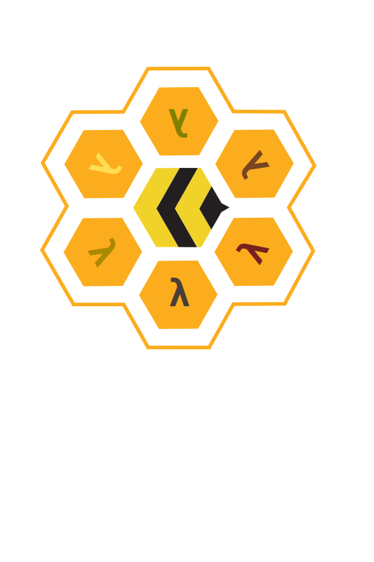

  
  <h1>The Hive</h1>
  
The secretly open NixOS-Society

---

# Table of Contents

1.  [How did I end up here?](#org78e5219)
2.  [System Component Overview](#orge918b31)
3.  [System Configuration Overview](#org8126b08)
    1.  [Hive](#org9123b7c)
        1.  [What is hive?](#org0760533)
        2.  [Why use Hive?](#orga452ffc)
        3.  [What about Digga?](#org65a862b)
    2.  [Hosts](#org0338a9f)
        1.  [μελετάω (Meletao : Thought)](#org25308dc)
        2.  [νέφος (Nephos : Cloud)](#orgec0d03b)
        3.  [Κουφίζω (Kouphizo : Lightweight)](#org1f2b8de)
        4.  [θυρεός (Thureos : Shield)](#org3cc2ac6)
        5.  [Κήρυγμα (Kerugma : Preach)](#orga441ec4)
    3.  [Suites](#org633d214)
    4.  [Profiles](#orgdb763cf)
4.  [Cool Nix projects](#orgccc2237)
    1.  [Implemented in this flake](#org2bd98c4)
    2.  [Others](#orgebaa9ef)
        1.  [Deployment](#org3b10491)
        2.  [Secrets Management](#orgb073a67)
        3.  [Misc](#org4dcfd7f)
5.  [Places I have learned from](#orgec751a2)
    1.  [New Nix or NixOs users](#org8acf7e4)
    2.  [General Flake stuff](#org5eaac5d)
    3.  [Standard Videos](#org27e277a)
    4.  [Random stuff I want to remember](#orgb2c01f8)

# How did I end up here?

I kept a list of programs that I had installed and was working on finding a program with which to manage all my meticulously crafted dotfiles while simultaneously jumping down the emacs rabbit hole, specifically [Doom Emacs](https://github.com/doomemacs/doomemacs) (Thanks [DistroTube](https://distro.tube/index.html) !) I fell in love with the configuration system of Doom Emacs.

I then started watching [System Crafters](https:systemcrafters.net) on YouTube and was introduced to [Guix](https:guix.gnu.org) which I tried to install on an older laptop that needed proprietary software in order to have operable WiFi. I looked for something that allowed unfree software and binary blobs out of the box, behold, NixOs.

For the last seven years I had distro hopped: Ubuntu, Debian, Arch, Fedora, Arch again, Manjaro, now my pursuit of sanity is done. I failed. I give up and Nixos is my final computational resting place.

If you are looking at this repo, I don&rsquo;t think I need to explain what [NixOS](https://www.nixos.org) is. I will warn you, once you take the first step of configuring a system, *You Will Never Go Back*.

# System Component Overview

<table border="2" cellspacing="0" cellpadding="6" rules="groups" frame="hsides">

<colgroup>
<col  class="org-left" />

<col  class="org-left" />

<col  class="org-left" />

<col  class="org-left" />

<col  class="org-left" />

<col  class="org-left" />
</colgroup>
<tbody>
<tr>
<td class="org-left">&#xa0;</td>
<td class="org-left">Meletao</td>
<td class="org-left">Kouphizo</td>
<td class="org-left">Kerugma</td>
<td class="org-left">Nephos</td>
<td class="org-left">Thureos</td>
</tr>

<tr>
<td class="org-left">Shell</td>
<td class="org-left">Fish</td>
<td class="org-left">Fish</td>
<td class="org-left">Fish</td>
<td class="org-left">Bash</td>
<td class="org-left">Bash</td>
</tr>

<tr>
<td class="org-left">Desktop Manager</td>
<td class="org-left">myXSession</td>
<td class="org-left">myXSession</td>
<td class="org-left">Gnome (Wayland)</td>
<td class="org-left">-</td>
<td class="org-left">-</td>
</tr>

<tr>
<td class="org-left">Window Manager</td>
<td class="org-left">Xmonad</td>
<td class="org-left">Xmonad</td>
<td class="org-left">Gnome</td>
<td class="org-left">-</td>
<td class="org-left">-</td>
</tr>

<tr>
<td class="org-left">Compositor</td>
<td class="org-left">Picom</td>
<td class="org-left">Picom</td>
<td class="org-left">&#xa0;</td>
<td class="org-left">-</td>
<td class="org-left">-</td>
</tr>

<tr>
<td class="org-left">Bar</td>
<td class="org-left">Xmobar</td>
<td class="org-left">Xmobar</td>
<td class="org-left">&#xa0;</td>
<td class="org-left">-</td>
<td class="org-left">-</td>
</tr>

<tr>
<td class="org-left">Hotkeys</td>
<td class="org-left">Xmonad</td>
<td class="org-left">Xmonad</td>
<td class="org-left">&#xa0;</td>
<td class="org-left">-</td>
<td class="org-left">-</td>
</tr>

<tr>
<td class="org-left">Launcher</td>
<td class="org-left">Rofi</td>
<td class="org-left">Rofi</td>
<td class="org-left">&#xa0;</td>
<td class="org-left">-</td>
<td class="org-left">-</td>
</tr>

<tr>
<td class="org-left">Theme</td>
<td class="org-left">Nord</td>
<td class="org-left">Nord</td>
<td class="org-left">&#xa0;</td>
<td class="org-left">-</td>
<td class="org-left">-</td>
</tr>

<tr>
<td class="org-left">Notifications</td>
<td class="org-left">Dunst</td>
<td class="org-left">Dunst</td>
<td class="org-left">&#xa0;</td>
<td class="org-left">-</td>
<td class="org-left">-</td>
</tr>

<tr>
<td class="org-left">Terminal</td>
<td class="org-left">Alacritty</td>
<td class="org-left">Alacritty</td>
<td class="org-left">&#xa0;</td>
<td class="org-left">-</td>
<td class="org-left">-</td>
</tr>

<tr>
<td class="org-left">Editor</td>
<td class="org-left">Neovim + Doom Emacs</td>
<td class="org-left">Neovim + Doom Emacs</td>
<td class="org-left">&#xa0;</td>
<td class="org-left">Neovim</td>
<td class="org-left">Neovim</td>
</tr>

<tr>
<td class="org-left">Web Browser</td>
<td class="org-left">Qutebrowser</td>
<td class="org-left">Qutebrowser</td>
<td class="org-left">Epiphany</td>
<td class="org-left">-</td>
<td class="org-left">-</td>
</tr>
</tbody>
</table>

# System Configuration Overview

This configuration uses NixOs [Flakes](https://nixos.wiki/wiki/Flakes) and the [Hive](https://github.com/divnix/hive) library/framework.

:NOTE: Understanding how to implement a flake based configuration took me a long time. I don&rsquo;t know how many times I have read the std docs and source code.

## Hive

### What is hive?

Hive is a Nixos system configuration flake with the naming convention around a beehive.

### Why use Hive?

I use hive primarily because of its integration with [std](https://github.com/divnix/std).

### What about Digga?

When I came across Divnix and [Digga](https://github.com/divnix/digga), I began to switch to it. I liked the organization of [Digga](https://github.com/divnix/digga) and it made sense while holding to the &rsquo;traditional&rsquo; nix flake layout. At the same time whilst digging around in the Divnix repos I couldn&rsquo;t help notice Hive and [std](https://github.com/divnix/std). As I read the Standard book (more than once) and played with it in &rsquo;nix repl&rsquo; I decided to skip the [Digga](https://github.com/divnix/digga) config and use [Hive](https://github.com/divnix/hive), this was further solidified after watching all of the [std](https://github.com/divnix/std) videos (linked below).

## Hosts

### μελετάω (Meletao : Thought)

-   Daily driver laptop, this is where I do most of my work.

### νέφος (Nephos : Cloud)

-   Desktop server
-   Runs cloud services

### Κουφίζω (Kouphizo : Lightweight)

-   Pinebook Pro
-   Light in weight and processing &#x2026;, great for traveling.

### θυρεός (Thureos : Shield)

-   Raspberry Pi Zero W
-   Protector of my network via pihole and tailscale.

### Κήρυγμα (Kerugma : Preach)

-   Microsoft Surface Go 2
-   Used when teaching

## Suites

These are collections of profiles.

## Profiles

These are applications configured for use in NixOs

# Cool Nix projects

## Implemented in this flake

-   [Home-manager](https://github.com/nix-community/home-manager)
-   [Colmena](https://github.com/zhaofengli/colmena)
-   [Disko](https://github.com/nix-community/disko)
-   [Devshell](https://github.com/numtide/devshell)
-   [Nix-colors](https://github.com/misterio77/nix-colors)
-   [Nixos-hardware](https://github.com/nix-community/nixos-hardware)
-   [Flake-utils](https://github.com/numtide/flake-utils)
-   [Flake-utils-plus](https://github.com/gytis-ivaskevicius/flake-utils-plus)
-   [Agenix](https://github.com/ryantm/agenix)

## Others

### Deployment

-   [Deploy-rs](https://github.com/serokell/deploy-rs)
-   [Morph](https://github.com/DBCDK/morph)

### Secrets Management

-   [Sops-nix](https://github.com/Mic92/sops-nix)
-   [Ragenix](https://github.com/yaxitech/ragenix) Rust based cli for agenix
-   [Homeage](https://github.com/jordanisaacs/homeage)

### Misc

-   [Dconf2nix](https://github.com/gvolpe/dconf2nix)
-   [Impermanence](https://github.com/nix-community/impermanence)

# Places I have learned from

## New Nix or NixOs users

-   <https://nixos.org/guides/nix-language.html>
-   <https://book.divnix.com/>
-   <https://nixos.org/manual/nix/stable/introduction.html>
-   <https://github.com/justinwoo/nix-shorts>
-   <https://ianthehenry.com/posts/how-to-learn-nix/introduction/>

## General Flake stuff

-   <https://www.tweag.io/blog/2020-05-25-flakes/>
-   <https://nixos.wiki/wiki/Flakes>
-   <https://github.com/hlissner/dotfiles>
-   <https://www.youtube.com/channel/UC-cY3DcYladGdFQWIKL90SQ>

## Standard Videos

These were what help me understand [std](https://github.com/divnix/std) the most. It makes sense of Hive&rsquo;s source code.

-   [Std - Introduction](https://www.loom.com/share/cf9d5d1a10514d65bf6b8287f7ddc7d6)
-   [Std - Cell Blocks Deep Dive](https://www.loom.com/share/04fa1d578fd044059b02c9c052d87b77)
-   [Std - Operables & OCI](https://www.loom.com/share/27d91aa1eac24bcaaaed18ea6d6d03ca)
-   [Std - Nixago](https://www.loom.com/share/5c1badd77ab641d3b8e256ddbba69042)

## Random stuff I want to remember

-   [Winter Theme](https://github.com/KubqoA/dotfiles)

